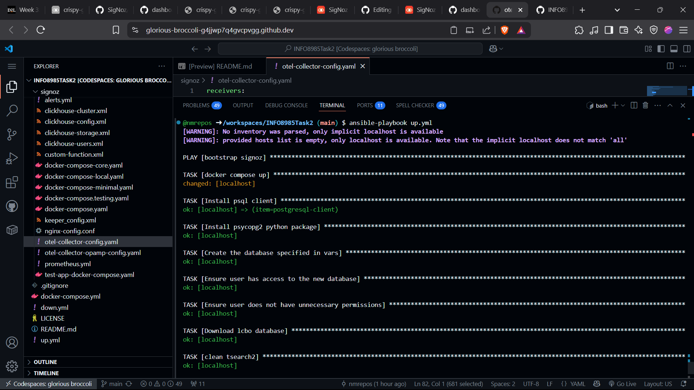

lcbo database with signoz demo

```bash
ansible-playbook up.yml
```

This does docker compose up on an "empty" signoz in a codespace. Use this as a starting point for instrumenting your app. It also creates a postgresql/pgadmin container with an old version of the LCBO database in it.

```bash
ansible-playbook down.yml
```

This does docker compose down on the `docker-compose.yml` (the same docker-compose file from up.yml)

# New receiver

[otel-collector-config](./signoz/otel-collector-config.yaml)

```yaml
sqlquery:
    driver: postgres
    datasource: 'host=db port=5432 user=devtedsuser password=devtedspass sslmode=disable'
    queries:
      - sql: 'select * from my_logs where log_id > $$1'
        tracking_start_value: '10000'
        tracking_column: log_id
        logs:
          - body_column: log_body
      - sql: 'select count(*) as count, genre from movie group by genre'
        metrics:
          - metric_name: movie.genres
            value_column: 'count'
  postgresql:
    endpoint: db:5432
    transport: tcp
    username: devtedsuser
    password: devtedspass
    connection_pool:
      max_idle_time: 10m
      max_lifetime: 0
      max_idle: 2
      max_open: 5
```
## Screenshot

